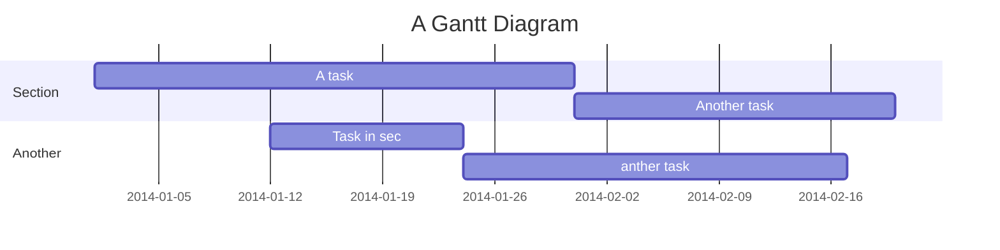

Cannon
===
<!--  -->


## Table of Contents

[TOC]

## Beginners Guide

If you are a total beginner to this, start here!

1. Visit hackmd.io
2. Click "Sign in"
3. Choose a way to sign in
4. Start writing note!

Installation
---
Instalation proccess on your machine is pretty simple, just follow the commands:
### MacOS

```bash
brew tap <some tap repo>
brew install cannon
```
### Ubuntu
```bash
sudo snap install cannon
```

Build requirements
---
* Rust >= 1.44.0 (stable)
* Cargo >= 1.44.0
* Shell

Build
---
#### Build debug
```bash
cargo build
```
#### Build release
```bash
cargo build --release
```

Documentation
---
### Basic
Start usage the `Cannon` is pretty simple. Just run application from command line
```bash
cannon ./manifest.yaml
```
```yaml
# manifest.yaml
name: Example
pipeline:
 test:
  - name: Echo example
    request: https://postman-echo.com/get
```
*Any other fields aren't required!*
`Cannon` supports many other file formats like `JSON`, `TOML`, `INI`, `HJSON`, `Yaml`

Here is the same example manifest but in `JSON` format
```json
// manifest.json
{
 "name": "Example",
 "pipeline": [
  {
   "name": "Echo example",
   "request": "https://postman-echo.com/get"
  }
 ]
}
```
### Advanced
#### Headers
#### Request body
`Cannon` supports many variants to build request body.
##### json
```yaml
pipeline:
 test:
 ...
  - name: Example
    body:
     json:
      key: 'value'
      array: [1, 2, 3, 4]
      object:
       another: 42
 ...
```
##### raw json
```yaml
pipeline:
 test:
 ...
  - name: Example
    body:
     raw: |-
          {
            "test": "test",
            "test1": {
              "key": "value",
              "template": "{{in-json | capitalize}}",
              "array": [1, 2, 3, 4, 5, 6, 7, 8, 9, 10]
            }
          }
 ...
```
##### raw data encoded as base64
```yaml
pipeline:
 test:
 ...
  - name: Example
    body:
     base64: JVBERi0xLjMNCiXi48/TDQoNCjEgMCBvYmoNCjw8DQovVHlwZSAvQ2F0YWxvZw0KL091dGxpbmVzIDIgMCBSDQovUGFnZXMgMyAwIFINCj4+DQplbmRvYmoNCg0KMiAwIG9iag0KPDwNCi9UeXBlIC9PdXRsaW5lcw0KL0NvdW50IDANCj4+DQplbmRvYmoNCg0KMyAwIG9iag0KPDwNCi9UeXBlIC9QYWdlcw0KL0NvdW50IDINCi9LaWRzIFsgNCAwIFIgNiAwIFIgXSANCj4+DQplbmRvYmoNCg0KNCAwIG9iag0KPDwNCi9UeXBlIC9QYWdlDQovUGFyZW50IDMgMCBSDQovUmVzb3VyY2VzIDw8DQovRm9udCA8PA0KL0YxIDkgMCBSIA0KPj4NCi9Qcm9jU2V0IDggMCBSDQo+Pg0KL01lZGlhQm94IFswIDAgNjEyLjAwMDAgNzkyLjAwMDBdDQovQ29udGVudHMgNSAwIFINCj4+DQplbmRvYmoNCg0KNSAwIG9iag0KPDwgL0xlbmd0aCAxMDc0ID4+DQpzdHJlYW0NCjIgSg0KQlQNCjAgMCAwIHJnDQovRjEgMDAyNyBUZg0KNTcuMzc1MCA3MjIuMjgwMCBUZA0KKCBBIFNpbXBsZSBQREYgRmlsZSApIFRqDQpFVA0KQlQNCi9GMSAwMDEwIFRmDQo2OS4yNTAwIDY4OC42MDgwIFRkDQooIFRoaXMgaXMgYSBzbWFsbCBkZW1vbnN0cmF0aW9uIC5wZGYgZmlsZSAtICkgVGoNCkVUDQpCVA0KL0YxIDAwMTAgVGYNCjY5LjI1MDAgNjY0LjcwNDAgVGQNCigganVzdCBmb3IgdXNlIGluIHRoZSBWaXJ0dWFsIE1lY2hhbmljcyB0dXRvcmlhbHMuIE1vcmUgdGV4dC4gQW5kIG1vcmUgKSBUag0KRVQNCkJUDQovRjEgMDAxMCBUZg0KNjkuMjUwMCA2NTIuNzUyMCBUZA0KKCB0ZXh0LiBBbmQgbW9yZSB0ZXh0LiBBbmQgbW9yZSB0ZXh0LiBBbmQgbW9yZSB0ZXh0LiApIFRqDQpFVA0KQlQNCi9GMSAwMDEwIFRmDQo2OS4yNTAwIDYyOC44NDgwIFRkDQooIEFuZCBtb3JlIHRleHQuIEFuZCBtb3JlIHRleHQuIEFuZCBtb3JlIHRleHQuIEFuZCBtb3JlIHRleHQuIEFuZCBtb3JlICkgVGoNCkVUDQpCVA0KL0YxIDAwMTAgVGYNCjY5LjI1MDAgNjE2Ljg5NjAgVGQNCiggdGV4dC4gQW5kIG1vcmUgdGV4dC4gQm9yaW5nLCB6enp6ei4gQW5kIG1vcmUgdGV4dC4gQW5kIG1vcmUgdGV4dC4gQW5kICkgVGoNCkVUDQpCVA0KL0YxIDAwMTAgVGYNCjY5LjI1MDAgNjA0Ljk0NDAgVGQNCiggbW9yZSB0ZXh0LiBBbmQgbW9yZSB0ZXh0LiBBbmQgbW9yZSB0ZXh0LiBBbmQgbW9yZSB0ZXh0LiBBbmQgbW9yZSB0ZXh0LiApIFRqDQpFVA0KQlQNCi9GMSAwMDEwIFRmDQo2OS4yNTAwIDU5Mi45OTIwIFRkDQooIEFuZCBtb3JlIHRleHQuIEFuZCBtb3JlIHRleHQuICkgVGoNCkVUDQpCVA0KL0YxIDAwMTAgVGYNCjY5LjI1MDAgNTY5LjA4ODAgVGQNCiggQW5kIG1vcmUgdGV4dC4gQW5kIG1vcmUgdGV4dC4gQW5kIG1vcmUgdGV4dC4gQW5kIG1vcmUgdGV4dC4gQW5kIG1vcmUgKSBUag0KRVQNCkJUDQovRjEgMDAxMCBUZg0KNjkuMjUwMCA1NTcuMTM2MCBUZA0KKCB0ZXh0LiBBbmQgbW9yZSB0ZXh0LiBBbmQgbW9yZSB0ZXh0LiBFdmVuIG1vcmUuIENvbnRpbnVlZCBvbiBwYWdlIDIgLi4uKSBUag0KRVQNCmVuZHN0cmVhbQ0KZW5kb2JqDQoNCjYgMCBvYmoNCjw8DQovVHlwZSAvUGFnZQ0KL1BhcmVudCAzIDAgUg0KL1Jlc291cmNlcyA8PA0KL0ZvbnQgPDwNCi9GMSA5IDAgUiANCj4+DQovUHJvY1NldCA4IDAgUg0KPj4NCi9NZWRpYUJveCBbMCAwIDYxMi4wMDAwIDc5Mi4wMDAwXQ0KL0NvbnRlbnRzIDcgMCBSDQo+Pg0KZW5kb2JqDQoNCjcgMCBvYmoNCjw8IC9MZW5ndGggNjc2ID4+DQpzdHJlYW0NCjIgSg0KQlQNCjAgMCAwIHJnDQovRjEgMDAyNyBUZg0KNTcuMzc1MCA3MjIuMjgwMCBUZA0KKCBTaW1wbGUgUERGIEZpbGUgMiApIFRqDQpFVA0KQlQNCi9GMSAwMDEwIFRmDQo2OS4yNTAwIDY4OC42MDgwIFRkDQooIC4uLmNvbnRpbnVlZCBmcm9tIHBhZ2UgMS4gWWV0IG1vcmUgdGV4dC4gQW5kIG1vcmUgdGV4dC4gQW5kIG1vcmUgdGV4dC4gKSBUag0KRVQNCkJUDQovRjEgMDAxMCBUZg0KNjkuMjUwMCA2NzYuNjU2MCBUZA0KKCBBbmQgbW9yZSB0ZXh0LiBBbmQgbW9yZSB0ZXh0LiBBbmQgbW9yZSB0ZXh0LiBBbmQgbW9yZSB0ZXh0LiBBbmQgbW9yZSApIFRqDQpFVA0KQlQNCi9GMSAwMDEwIFRmDQo2OS4yNTAwIDY2NC43MDQwIFRkDQooIHRleHQuIE9oLCBob3cgYm9yaW5nIHR5cGluZyB0aGlzIHN0dWZmLiBCdXQgbm90IGFzIGJvcmluZyBhcyB3YXRjaGluZyApIFRqDQpFVA0KQlQNCi9GMSAwMDEwIFRmDQo2OS4yNTAwIDY1Mi43NTIwIFRkDQooIHBhaW50IGRyeS4gQW5kIG1vcmUgdGV4dC4gQW5kIG1vcmUgdGV4dC4gQW5kIG1vcmUgdGV4dC4gQW5kIG1vcmUgdGV4dC4gKSBUag0KRVQNCkJUDQovRjEgMDAxMCBUZg0KNjkuMjUwMCA2NDAuODAwMCBUZA0KKCBCb3JpbmcuICBNb3JlLCBhIGxpdHRsZSBtb3JlIHRleHQuIFRoZSBlbmQsIGFuZCBqdXN0IGFzIHdlbGwuICkgVGoNCkVUDQplbmRzdHJlYW0NCmVuZG9iag0KDQo4IDAgb2JqDQpbL1BERiAvVGV4dF0NCmVuZG9iag0KDQo5IDAgb2JqDQo8PA0KL1R5cGUgL0ZvbnQNCi9TdWJ0eXBlIC9UeXBlMQ0KL05hbWUgL0YxDQovQmFzZUZvbnQgL0hlbHZldGljYQ0KL0VuY29kaW5nIC9XaW5BbnNpRW5jb2RpbmcNCj4+DQplbmRvYmoNCg0KMTAgMCBvYmoNCjw8DQovQ3JlYXRvciAoUmF2ZSBcKGh0dHA6Ly93d3cubmV2cm9uYS5jb20vcmF2ZVwpKQ0KL1Byb2R1Y2VyIChOZXZyb25hIERlc2lnbnMpDQovQ3JlYXRpb25EYXRlIChEOjIwMDYwMzAxMDcyODI2KQ0KPj4NCmVuZG9iag0KDQp4cmVmDQowIDExDQowMDAwMDAwMDAwIDY1NTM1IGYNCjAwMDAwMDAwMTkgMDAwMDAgbg0KMDAwMDAwMDA5MyAwMDAwMCBuDQowMDAwMDAwMTQ3IDAwMDAwIG4NCjAwMDAwMDAyMjIgMDAwMDAgbg0KMDAwMDAwMDM5MCAwMDAwMCBuDQowMDAwMDAxNTIyIDAwMDAwIG4NCjAwMDAwMDE2OTAgMDAwMDAgbg0KMDAwMDAwMjQyMyAwMDAwMCBuDQowMDAwMDAyNDU2IDAwMDAwIG4NCjAwMDAwMDI1NzQgMDAwMDAgbg0KDQp0cmFpbGVyDQo8PA0KL1NpemUgMTENCi9Sb290IDEgMCBSDQovSW5mbyAxMCAwIFINCj4+DQoNCnN0YXJ0eHJlZg0KMjcxNA0KJSVFT0YNCg==
 ...
```
##### raw data from file
This option load raw data from file. In this case you need to define `Content-Type` manually.
```yaml
pipeline:
 test:
 ...
  - name: Example
    body:
     uri: file://./some_picture.png
 ...
```
##### form
### Collectors
### Variables and Resources
### Template
`Cannon` includes `Liquid` template engine that makes possible 
to use inline variables inside request body, headers, request uri. Basically
you can use placeholder `{{ here your variable }}`.
```yaml
pipeline:
 test:
 ...
  - name: Example
    request: http://{{domain}}:{{port}}
    vars:
     domain: example.com
     port: 80
     value: some value
    body:
     json:
      key: {{value}}
 ...
```
`Liquid` supports many filters in standard library. Its can use for
changing values in variables as you need. Just use filter in placeholder `{{ here your variable | filter name}}`
```yaml
pipeline:
 test:
 ...
  - name: Example
    request: http://{{domain}}:{{port}}
    vars:
     domain: example.com
     port: 80
     value: some value
    body:
     json:
      key: {{value | downcase}} #convert an input string to lowercase
 ...
```
Additional information to can get in [Liquid Official documentation](https://github.com/Shopify/liquid/wiki/Liquid-for-Designers)
### Test lifetime
### Conditional execution
### Grouping
### States
#### Global
#### Test
#### Group
### Capturing
One day you will may to check or store some value from response `Cannon` makes possible to capture it. `Cannon` supports several kinds of capture depends on response body content type.
| Content-Type     | Capture |
| ---------------- | ------- |
| application/xml  | xpath   |
| application/json | json    |
| all              | regex   |

#### Json-Path
You can capture specific key of json body using [JsonPath](https://goessner.net/articles/JsonPath/). 
This is an example of simple response body in **application/json** format:
```json
{
    "store": {
        "book": [
            {
                "category": "reference",
                "author": "Nigel Rees",
                "title": "Sayings of the Century",
                "price": 8.95
            },
            {
                "category": "fiction",
                "author": "Evelyn Waugh",
                "title": "Sword of Honour",
                "price": 12.99
            },
            {
                "category": "fiction",
                "author": "Herman Melville",
                "title": "Moby Dick",
                "isbn": "0-553-21311-3",
                "price": 8.99
            },
            {
                "category": "fiction",
                "author": "J. R. R. Tolkien",
                "title": "The Lord of the Rings",
                "isbn": "0-395-19395-8",
                "price": 22.99
            }
        ],
        "bicycle": {
            "color": "red",
            "price": 19.95
        }
    },
    "expensive": 10
}
```

| JsonPath (click link to try)| Result |
| :------- | :----- |
| <a href="http://jsonpath.herokuapp.com/?path=$.store.book[*].author" target="_blank">$.store.book[*].author</a>| The authors of all books     |
| <a href="http://jsonpath.herokuapp.com/?path=$..author" target="_blank">$..author</a>                   | All authors                         |
| <a href="http://jsonpath.herokuapp.com/?path=$.store.*" target="_blank">$.store.*</a>                  | All things, both books and bicycles  |
| <a href="http://jsonpath.herokuapp.com/?path=$.store..price" target="_blank">$.store..price</a>             | The price of everything         |
| <a href="http://jsonpath.herokuapp.com/?path=$..book[2]" target="_blank">$..book[2]</a>                 | The third book                      |
| <a href="http://jsonpath.herokuapp.com/?path=$..book[2]" target="_blank">$..book[-2]</a>                 | The second to last book            |
| <a href="http://jsonpath.herokuapp.com/?path=$..book[0,1]" target="_blank">$..book[0,1]</a>               | The first two books               |
| <a href="http://jsonpath.herokuapp.com/?path=$..book[:2]" target="_blank">$..book[:2]</a>                | All books from index 0 (inclusive) until index 2 (exclusive) |
| <a href="http://jsonpath.herokuapp.com/?path=$..book[1:2]" target="_blank">$..book[1:2]</a>                | All books from index 1 (inclusive) until index 2 (exclusive) |
| <a href="http://jsonpath.herokuapp.com/?path=$..book[-2:]" target="_blank">$..book[-2:]</a>                | Last two books                   |
| <a href="http://jsonpath.herokuapp.com/?path=$..book[2:]" target="_blank">$..book[2:]</a>                | Book number two from tail          |
| <a href="http://jsonpath.herokuapp.com/?path=$..book[?(@.isbn)]" target="_blank">$..book[?(@.isbn)]</a>          | All books with an ISBN number         |
| <a href="http://jsonpath.herokuapp.com/?path=$.store.book[?(@.price < 10)]" target="_blank">$.store.book[?(@.price < 10)]</a> | All books in store cheaper than 10  |
| <a href="http://jsonpath.herokuapp.com/?path=$..book[?(@.price <= $['expensive'])]" target="_blank">$..book[?(@.price <= $['expensive'])]</a> | All books in store that are not "expensive"  |
| <a href="http://jsonpath.herokuapp.com/?path=$..book[?(@.author =~ /.*REES/i)]" target="_blank">$..book[?(@.author =~ /.*REES/i)]</a> | All books matching regex (ignore case)  |
| <a href="http://jsonpath.herokuapp.com/?path=$..*" target="_blank">$..*</a>                        | Give me every thing

So you can define capturing like this
```yaml
pipeline:
 test:
 ...
  - name: Example
    capture:
     - json: '$.store.book[*].author'
       as: key_value #store into variable with name key_value
       on: [] #explained below
 ...
```
#### XPath
*TBD*
#### RegEx
#### Assertation
### Scripting
#### JavaScript
#### Lua
*TBD*
### Load testing and prallelism
### Distributed mode
### Report
### Manifest reference

Project Timeline
---


> Read more about mermaid here: http://mermaid-js.github.io/mermaid/

## Appendix and FAQ

:::info
**Find this document incomplete?** Leave a comment!
:::

###### tags: `Cannon` `API` `Testing` `Documentation`
